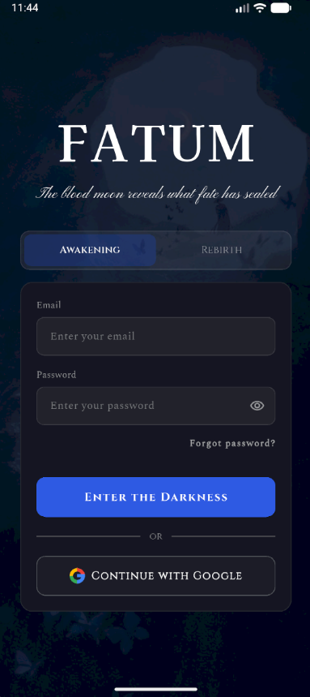
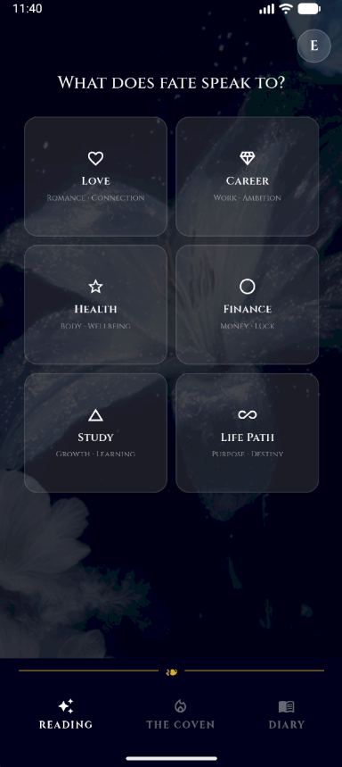
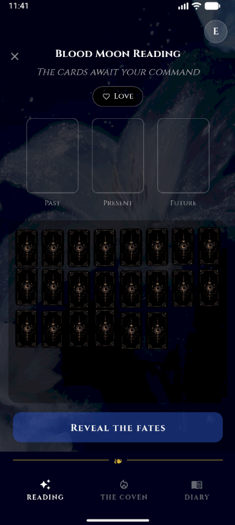
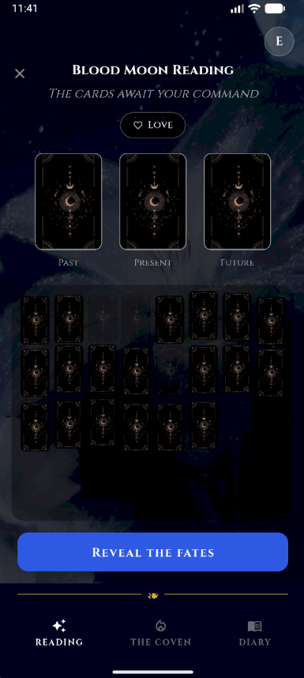
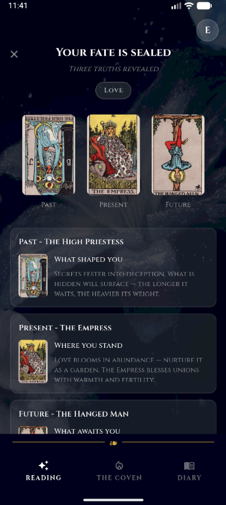
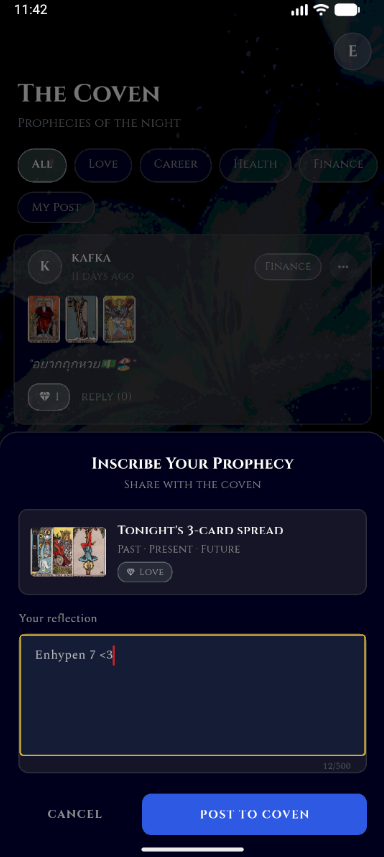
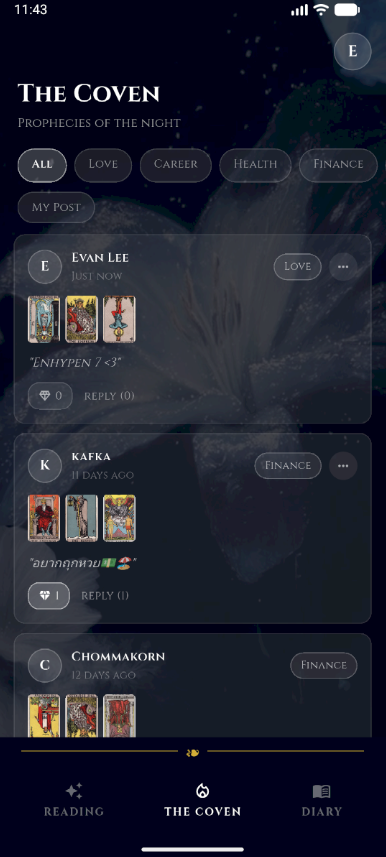
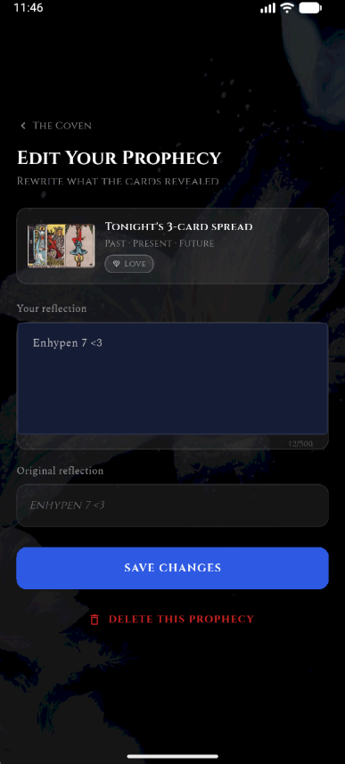
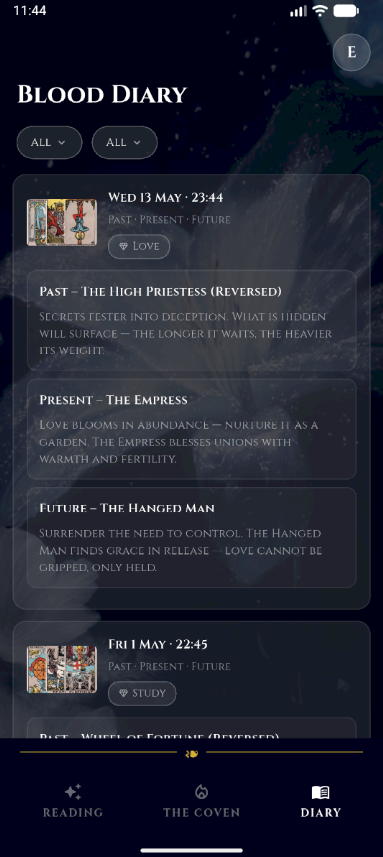

# FATUM  
*A gothic tarot experience forged in Flutter.*

🌑 **Live Preview (Deployed App):**  
[FATUM Web App](https://fatum-371c1.web.app/)


---

## 🩸 Inspiration

FATUM was heavily inspired by ENHYPEN's **DARK BLOOD** concept and atmosphere — combining gothic aesthetics, fate, blood, prophecy, and dark fantasy storytelling into an interactive tarot experience.

🎵 Inspiration Reference:  
[ENHYPEN – DARK BLOOD Concept Video](https://www.youtube.com/watch?v=47SAocGDKrw&list=RD47SAocGDKrw&start_radio=1&pp=ygUSZW5oeXBlbiBkYXJrIGJsb29koAcB&utm_source=chatgpt.com)

---

## ✨ Overview

**FATUM** is a gothic-themed tarot reading application built with Flutter.  
Users can perform mystical readings, preserve prophecies inside a personal **Blood Moon Diary**, and share revelations with a social community known as **The Coven**.

The experience combines animated tarot interactions, offline persistence, Firebase-powered social features, and dark atmospheric UI design.

---

# 🩸 Visual Showcase

## 🌑 Mood Board


> The visual identity of FATUM draws from gothic romance, blood rituals, cathedral architecture, tarot symbolism, moonlit atmospheres, and the DARK BLOOD aesthetic.

---

## 🔮 App Screenshots

| | | |
|---|---|---|
|  |  |  |
|  |  |  |
|  |  |  |

### Featured Screens
1. Log In  
2. Blood Mood Reading — Main Page  
3. Blood Mood Reading — Awaiting Ritual  
4. Tarot Card Selection  
5. Fate Revealed  
6. Write a Post to The Coven  
7. The Coven Community Feed  
8. Edit the Prophecy  
9. Blood Moon Diary  

---

# 🕯 Features

## 🔮 Tarot Readings

Perform a three-card reading using the **22-card Major Arcana deck**.

### Reading Flow
- Select a topic:
  - Love
  - Career
  - Health
  - Finance
  - Study
  - Life Path
- Draw 3 tarot cards
- Watch cards animate and reveal themselves
- Receive unique prophecies based on:
  - Card identity
  - Reading position *(Past · Present · Future)*
  - Orientation *(Upright / Reversed)*

### Highlights
- Animated card spin & reveal
- Topic-aware prophecy system
- Atmospheric gothic presentation

---

## 🩸 Blood Moon Diary

Seal readings into a private offline journal.

### Capabilities
- Save readings locally with Hive
- Browse previous prophecies
- Filter by:
  - Topic
  - Date range
- View complete prophecy details for:
  - Past
  - Present
  - Future

---

## 🕯 The Coven

A shared space for mystical confessions and tarot revelations.

### Community Features
- Publish readings to a public feed
- Add personal reflections
- React to other users' prophecies
- Filter by topic
- View your own posts
- Edit or delete your entries

Powered by Cloud Firestore for real-time social interaction.

---

## 🔐 Authentication

Supports multiple authentication flows via Firebase Authentication.

### Included
- Email & password sign-in
- User registration
- Google Sign-In
- Password reset via email

---

# ⚙️ Tech Stack

| Layer | Technology |
|---|---|
| Framework | Flutter (Dart) |
| Authentication | Firebase Authentication |
| Database | Cloud Firestore |
| Local Storage | Hive |
| Hosting | Firebase Hosting |
| Fonts | Google Fonts |
| UI Style | Gothic / Mystical Theme |

### Typography
- Cormorant Garamond
- Roboto Mono

---

# 📁 Project Structure

```txt
lib/
├── core/           # App shell & routing
├── data/           # Tarot deck data & prophecy texts
├── models/         # App data models
├── pages/
│   ├── awakening/  # Authentication flows
│   ├── reading/    # Tarot reading experience
│   ├── diary/      # Blood Moon Diary
│   ├── coven/      # Community feed
│   └── edit_post/  # Edit/Delete community posts
├── services/       # Firebase & local services
├── theme/          # Colors & visual styling
└── ui/
    ├── atoms/      # Primitive UI components
    ├── molecules/  # Composite widgets
    └── templates/  # Layout wrappers
```

---

# 🚀 Getting Started

## Prerequisites

- Flutter SDK
- Firebase project with Authentication and Cloud Firestore enabled
- `lib/firebase_options.dart` generated via:

```bash
flutterfire configure
```

> `firebase_options.dart` is gitignored — do not commit it.

## Run the App

```bash
flutter pub get
flutter run              # Android / default device
flutter run -d chrome    # Web (Chrome)
```

---

# 🧪 Testing

FATUM's test suite is split into three tiers following the **Testing Pyramid** strategy.  
All unit and widget tests run without a device or Firebase connection.

## Run All Tests

```bash
flutter test
```

## Test Structure

```
test/
├── unit/
│   ├── reading_logic_test.dart    # 9 unit tests — Business Logic
│   └── bva_validation_test.dart   # 29 BVA/EP tests — Input Validation
└── widget/
    └── widget_test.dart           # 10 widget tests — UI Components

integration_test/
└── app_test.dart                  # 10 integration tests — E2E Flows
```

## Coverage Summary

| Tier | File | Cases | What It Tests |
|---|---|---|---|
| **Unit** | `reading_logic_test.dart` | 9 | ReadingLogic, Hive serialisation, Daily Lock, canSave |
| **Unit (BVA)** | `bva_validation_test.dart` | 29 | Email, Password, reflectionText — EP & Boundary Value Analysis |
| **Widget** | `widget_test.dart` | 10 | TopicPicker, CardGridStep, Reveal Button state |
| **Integration** | `app_test.dart` | 10 | Navigation flows, scaffold rendering across all pages |

## Run Individual Suites

```bash
# Unit — Business Logic
flutter test test/unit/reading_logic_test.dart

# Unit — Input Validation (BVA)
flutter test test/unit/bva_validation_test.dart

# Widget
flutter test test/widget/widget_test.dart

# Integration (no device required for navigation tests)
flutter test integration_test/app_test.dart

# Integration — Android device
flutter test integration_test/app_test.dart -d <device_id>
```

## Requirements Coverage

| Requirement | Description | Covered By |
|---|---|---|
| R1 | Secure Login/Logout (Firebase Auth) | IT-01, IT-03–05, IT-08 |
| R2 | Routing across 5+ pages | UT-01–03, WT-01–03, IT-NAV-01–02 |
| R3 | Android + Web execution | All integration tests |
| R4 | Firestore + Hive data storage | UT-04, UT-05, UT-08, IT-01–08 |
| R5 | CLI-runnable via `flutter test` | All tiers |

---

# 🚢 CI / CD

GitHub Actions automatically deploys preview environments on pull requests targeting `main` via Firebase Hosting.

---

# 📜 Academic Use

Developed for:
- **SEA605** — Mobile Application Design and Development  
- **SEA606** — Modern Software Testing

---

# 🩸 Author

Built with Flutter, Firebase, and a love for gothic storytelling.